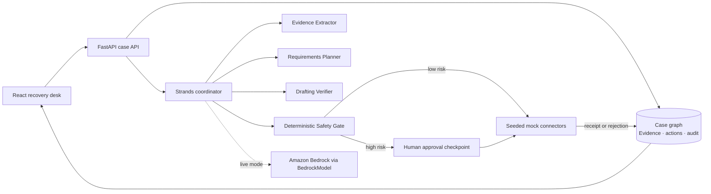

# RE:ENTRY architecture

RE:ENTRY is intentionally a small, inspectable system: an agent proposes a
grounded recovery plan, while deterministic policy code controls every action
that could affect a person or an external service.

## Request flow

1. The case starts with synthetic county, lease, photo, insurer, estimate, and
   utility evidence. Uploaded files are bounded before multipart parsing,
   streamed without a replay buffer, subject to an absolute request deadline,
   per-chunk deadline, and chunk cap, size-limited, filename-validated, and
   quarantined as `needs_review`;
   text excerpts are control-character-sanitized before persistence.
   The demo also caps each case at 100 evidence records and 100 plan passes so
   planner input and in-memory history remain bounded. Live mode uses a
   separate non-resettable budget that defaults to 10 passes and is bounded to
   100 by `REENTRY_MAX_LIVE_PLAN_RUNS`. A process-wide non-blocking planner
   semaphore (`REENTRY_MAX_IN_FLIGHT_PLANS`, default 8) rejects excess work
   before provider calls; durable per-tenant limits remain a deployment task.
2. The Strands-compatible coordinator builds a plan from the case snapshot.
   The demo adapter uses a deterministic `strands.Agent` + structured-output
   model with no network call. `REENTRY_MODE=live` swaps in
   `strands.Agent` + `BedrockModel`, requires AWS credentials, enforces the
   configured region/model allowlists, and excludes unreviewed evidence unless
   an operator explicitly opts in. The verified-only snapshot also projects
   action metadata and withholds case summaries, targets, and rationales that
   are not required for planning. Common direct identifiers in provider text
   are redacted by default; `REENTRY_LIVE_ALLOW_PII=true` is an explicit,
   deployment-reviewed opt-in rather than a default. This is a minimization
   layer, not a complete PII classifier. Live readiness fails closed until a durable
   case store is configured; `REENTRY_ALLOW_EPHEMERAL_STORE=true` is reserved
   for local synthetic-provider tests.
   Each live request is bounded to four agent turns, 1,200 output tokens, and
   12,000 total tokens; provider retries and read timeouts remain bounded.
3. Evidence citations and a trace step are attached to each plan pass. Source
   text is data, never an instruction, and cannot mutate the case by itself.
4. The safety gate classifies risk. Actions that share an address, create an
   official case, or contact a person remain `needs_approval`.
5. A reviewer approves one prepared action. The mock connector returns a
   receipt, and the immutable-in-practice audit trail records reviewer, note,
   citations, outcome, inspected case revision, and whether the actor is a
   trusted principal. Approval is bound to the case revision the reviewer
   inspected; the demo explicitly
   marks its caller-provided reviewer label as unverified.
6. A connector rejection is converted into evidence. The replanner adds a
   cited follow-up while preserving the same approval boundary.

## AWS mapping for the next deployment slice

| Local boundary | AWS-ready boundary |
| --- | --- |
| FastAPI process | AgentCore Runtime HTTP container or a container behind API Gateway |
| In-memory `CaseStore` | DynamoDB case/evidence records + S3 object storage |
| `strands.Agent` live adapter | Strands Agents SDK on AgentCore Runtime |
| Seeded mock connectors | AgentCore Gateway targets with registered credentials |
| Local audit list | DynamoDB stream + CloudTrail/CloudWatch retention policy |
| Demo `REENTRY_MODE=demo` | Production `REENTRY_MODE=live` with scoped Bedrock IAM |

AgentCore is deliberately not claimed as deployed in this repository yet: the
checked-in `agentcore/agentcore.json` is a deployment specification, not an AWS
receipt. The code keeps the runtime boundary explicit so adding Runtime,
Gateway, JWT/SigV4 auth, and managed storage does not change the approval
contract.

The runtime seam is now explicit locally: `/health` and `/ping` are readiness
aliases, while `POST /invocations` accepts only a bounded `case_id` and the
plan operation. It cannot approve, submit, or call a connector. Request-body
limits are enforced before FastAPI parses JSON or multipart input, and the
interactive docs/OpenAPI schema are disabled. AgentCore Runtime deployment
still requires an ARM64 image, an authorizer, scoped IAM, and a verified AWS
endpoint.
