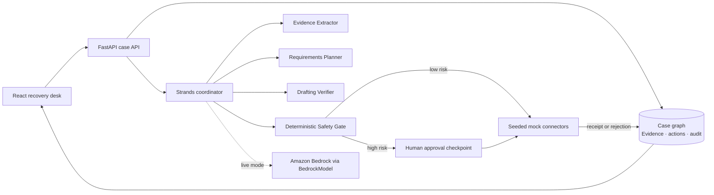

# RE:ENTRY architecture

RE:ENTRY is intentionally a small, inspectable system: an agent proposes a
grounded recovery plan, while deterministic policy code controls every action
that could affect a person or an external service.

## Request flow

1. The case starts with synthetic county, lease, photo, insurer, estimate, and
   utility evidence. Uploaded files are size-limited, filename-validated, and
   quarantined as `needs_review`.
2. The Strands-compatible coordinator builds a plan from the case snapshot.
   The live adapter uses `strands.Agent` + `BedrockModel` only when
   `REENTRY_MODE=live`; default demo mode is deterministic and requires no AWS
   credentials.
3. Evidence citations and a trace step are attached to each plan pass. Source
   text is data, never an instruction, and cannot mutate the case by itself.
4. The safety gate classifies risk. Actions that share an address, create an
   official case, or contact a person remain `needs_approval`.
5. A reviewer approves one prepared action. The mock connector returns a
   receipt, and the immutable-in-practice audit trail records reviewer, note,
   citations, and outcome.
6. A connector rejection is converted into evidence. The replanner adds a
   cited follow-up while preserving the same approval boundary.

## AWS mapping for the next deployment slice

| Local boundary | AWS-ready boundary |
| --- | --- |
| FastAPI process | AgentCore Runtime or a container behind API Gateway |
| In-memory `CaseStore` | DynamoDB case/evidence records + S3 object storage |
| `strands.Agent` live adapter | Strands Agents SDK on AgentCore Runtime |
| Seeded mock connectors | AgentCore Gateway targets with registered credentials |
| Local audit list | DynamoDB stream + CloudTrail/CloudWatch retention policy |
| Demo `REENTRY_MODE=demo` | Production `REENTRY_MODE=live` with scoped Bedrock IAM |

AgentCore is deliberately not claimed as deployed in this repository yet: the
local `agentcore` CLI was unavailable during the first build slice. The code
keeps the runtime boundary explicit so adding Runtime, Gateway, JWT/SigV4 auth,
and managed storage does not change the approval contract.

